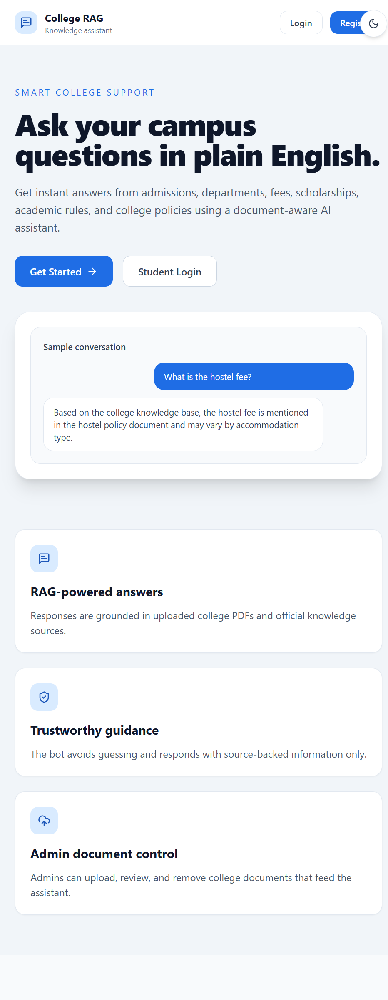
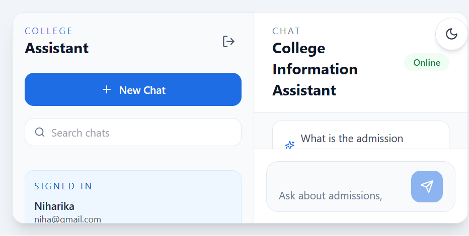
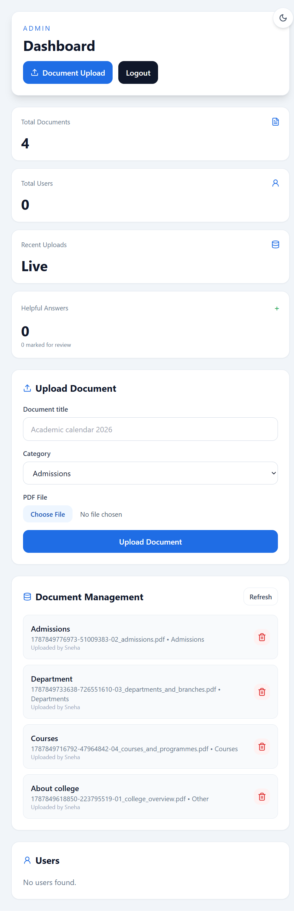

# College RAG Chatbot

A document-grounded college information assistant for students and administrators. Students can ask questions in natural language, while administrators manage the official PDF documents used as the knowledge base.

## Problem Statement

College information is often spread across admission notices, course documents, fee details, academic calendars, placement information, and policy PDFs. Students may struggle to find the correct answer quickly or may receive incomplete information from generic chatbots.

This project provides one place to ask college-related questions. It retrieves relevant content from uploaded college documents and generates answers grounded in that content, with source references shown to the user.

## Features

### Core Features

- Chat interface for college-related questions
- Student and administrator authentication
- Role-based access control
- Admin PDF document upload and deletion
- PDF text extraction and chunking
- Embedding generation for document chunks
- Pinecone vector database storage
- Semantic similarity search
- Hybrid keyword and semantic re-ranking
- Retrieval-Augmented Generation (RAG) pipeline
- Gemini-generated answers based on retrieved documents
- Source/reference display for answers
- Unknown-question handling without invented information
- Chat history and conversation management
- Answer feedback with helpful/not-helpful controls
- MongoDB database storage
- Frontend-backend integration
- Deployed frontend and backend

### Bonus Features

- Department and category-wise document organization
- Suggested questions
- Relevance scores for retrieved sources
- Admin dashboard with document and user overview
- Night mode
- Responsive interface
- Graceful fallback answers when the AI service is unavailable

## RAG Pipeline

```text
College PDFs
  -> Text extraction
  -> Text chunking
  -> Embeddings
  -> Pinecone vector database
  -> Similarity search and re-ranking
  -> Relevant context
  -> Gemini AI
  -> Source-backed final answer
```

## Technology Stack

### Frontend

- React 18
- Vite
- React Router
- Tailwind CSS
- Axios
- Lucide React icons

### Backend

- Node.js
- Express
- Mongoose
- JSON Web Tokens (JWT)
- bcryptjs
- Multer
- pdf-parse
- dotenv

### Databases and AI Services

- MongoDB Atlas for users, chats, and document metadata
- Pinecone for vector storage and semantic search
- Google Gemini API for answer generation
- Local 1024-dimension embedding generation

## Screenshots

Add screenshots of these application screens to a `screenshots/` folder before final submission:

- `screenshots/landing-page.png` - Landing page
- `screenshots/login-page.png` - Student login
- `screenshots/chat-page.png` - Chat interface with an answer and source
- `screenshots/admin-dashboard.png` - Admin document management
- `screenshots/document-upload.png` - PDF upload form

Example Markdown after adding the images:

```markdown



```

Do not include screenshots containing passwords, API keys, tokens, or private personal information.

## Live Demo

Frontend: https://ai-college-chatbot-cmvb.vercel.app

Student login: https://ai-college-chatbot-cmvb.vercel.app/login

Admin login: https://ai-college-chatbot-cmvb.vercel.app/login?admin=true

## Backend

API: https://ai-college-chatbot-5w6b.onrender.com

Health check: https://ai-college-chatbot-5w6b.onrender.com/api/health

## Local Setup

### Requirements

- Node.js 18 or newer
- MongoDB Atlas account or local MongoDB
- Pinecone account and an index configured for 1024 dimensions
- Google Gemini API key

### Installation

From the repository root:

```powershell
npm run install:all
```

### Environment Variables

Create `backend/.env` using `backend/.env.example` as a template. Create `frontend/.env` using `frontend/.env.example` for local development.

Required backend variable names:

```env
PORT
MONGODB_URI
JWT_SECRET
GEMINI_API_KEY
GEMINI_MODEL
PINECONE_API_KEY
PINECONE_INDEX
EMBEDDING_MODEL
FRONTEND_URL
```

Required frontend variable name:

```env
VITE_API_URL
```

Never commit `.env` files or real credentials to GitHub.

### Run Locally

Run both applications from the repository root:

```powershell
npm run dev
```

Or run them separately:

```powershell
npm run dev:backend
npm run dev:frontend
```

Open the local frontend at:

```text
http://localhost:5173
```

The local backend health check is:

```text
http://localhost:5005/api/health
```

## Accounts and Roles

Registration creates a student account. To create an administrator:

1. Register an account through the application.
2. Open the MongoDB Atlas `college_rag` database.
3. Open the `users` collection.
4. Change that user's `role` from `student` to `admin`.
5. Open the admin login URL and select the Admin role.

Selecting Admin in the login form does not grant administrator permissions by itself.

## Document Upload

1. Sign in as an administrator.
2. Open the admin dashboard.
3. Enter a document title and category.
4. Select a text-based PDF.
5. Upload the document.

The backend extracts the text, creates chunks and embeddings, stores vectors in Pinecone, and saves document metadata in MongoDB. PDF files must be no larger than 10 MB. Scanned image-only PDFs may require OCR and may not produce useful text with the current parser.

## Deployment

### Render Backend

```text
Root Directory: backend
Build Command: npm install
Start Command: npm start
```

Add all backend environment variables in the Render dashboard. Render supplies the `PORT` value automatically.

### Vercel Frontend

```text
Root Directory: frontend
Framework Preset: Vite
Build Command: npm run build
Output Directory: dist
Install Command: npm install
```

The Vercel frontend uses the `/api` path and forwards API requests to the Render backend through `frontend/vercel.json`.

## Troubleshooting

### Login or registration fails

- Confirm the Render backend health check returns status `200`.
- Confirm the Vercel deployment uses the latest commit.
- Confirm Render has `MONGODB_URI` configured.
- Confirm Render `FRONTEND_URL` matches the deployed Vercel URL exactly.
- Confirm the frontend is deployed with the Vercel API rewrite.

### Chat returns no document information

- Confirm the document upload completed successfully.
- Confirm the document has a non-zero chunk count.
- Confirm the Pinecone index exists and uses 1024 dimensions.
- Confirm the Gemini and Pinecone environment variables are valid.

### Admin access is rejected

The account must have `role: "admin"` in the MongoDB `users` collection. The login role selector does not change the stored role.

## Production Validation

Build the frontend:

```powershell
npm run build
```

Start the backend:

```powershell
npm --prefix backend start
```

The repository is configured to keep credentials out of GitHub through `.gitignore` and sanitized `.env.example` files.
